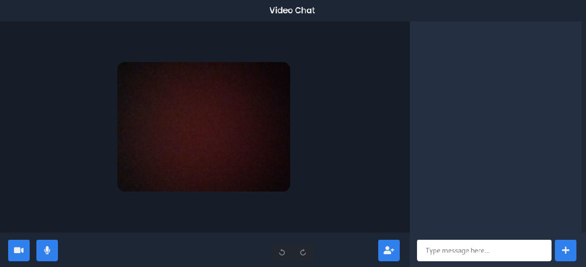

# VideoChatApp

A simple video chat app built using express, socket.io and peerjs

## Installation

1. git clone .
2. npm install.

## Usage

1. npm start.
2. Start using this link `http://127.0.0.1:3000/` or `http://localhost:3000/`.